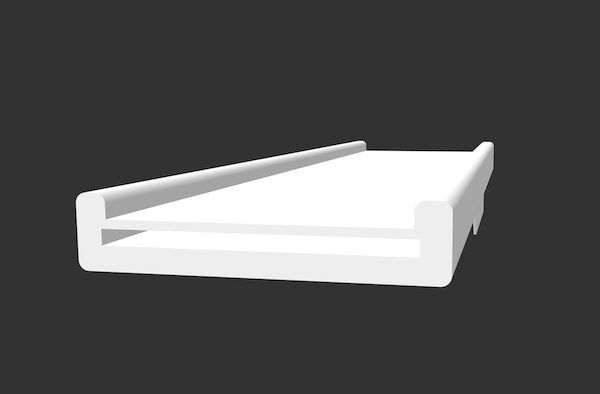
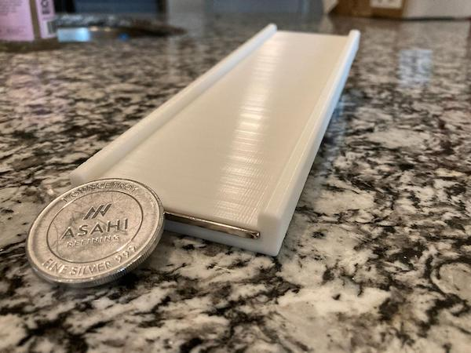

# magnetic-slide

## Description

Copper, silver, and a host of other materials possess a property called [diamagnetism](https://en.wikipedia.org/wiki/Diamagnetism).  When a magnetic field is applied to them, it induces an opposite magnetic field in the material.

This project resulted in a chute of sorts with strong neodymium magnets underneath the contact surface.  As something like a copper or silver coin attempts to slide to the bottom due to gravity, diamagnetism causes its velocity to slow down dramatically.

## Required Materials

In addition to the non-magnetic printing material of your choice, you will also need approximately twenty-three neodymium magnets of 60mm x 10mm x 3mm dimensions.

## Printing and Finishing

Recommended is to print the slide in a vertical orientation such that the opening for the magnets if facing upwards.  Once printed, the thin tabs should be broken off.  Their sole purpose is to help with adhesion to the print bed during the printing process.

Magnets should then be added one at a time in reversing polarity into the cutout such that they attract one another and do not repel.  Once the 23rd magnet has been installed into place, push down the magnets and seal the mouth of the cutout opening with hot glue.